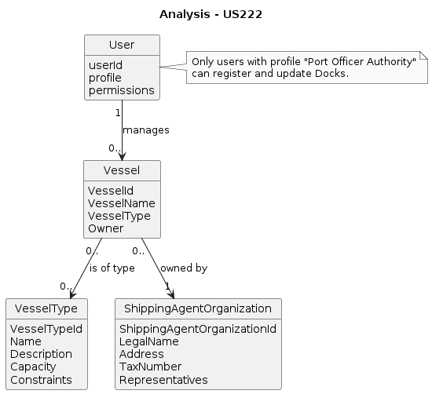
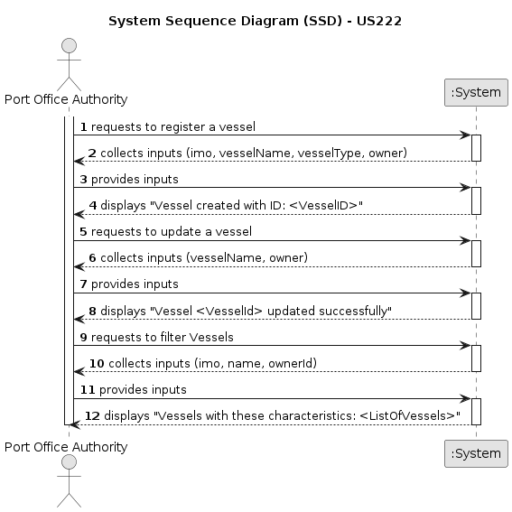
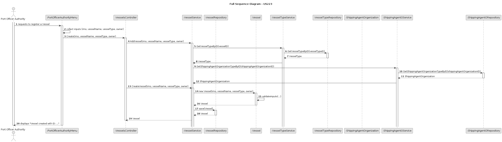
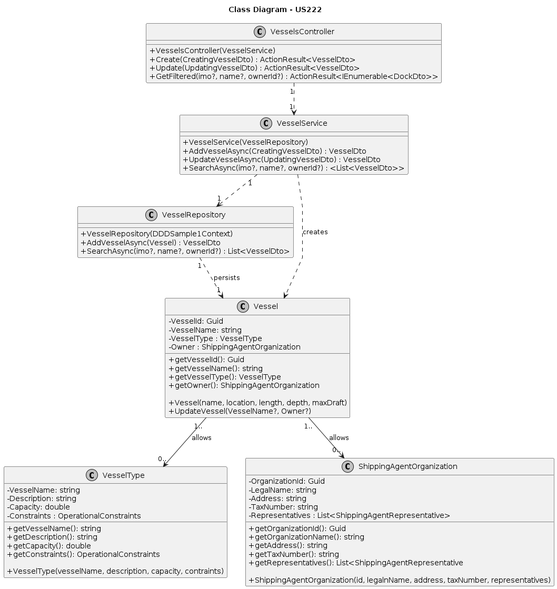

# US222 - Register and Update Vessels

## 1. Context
This user story, assigned in Sprint 1, enables Port Authority Officers to register and update vessels within the Port Management System. It supports the core operational process of maintaining accurate information on vessels facilities, including IMO number, vessel name, vessel type and owner. By allowing officers to create, modify, and validate vessel data, the system ensures that the port’s vessel database is always up to date and aligned with current maritime operations. This functionality is critical for effective port planning, traffic management, and compliance with maritime regulations.

### 1.1 List of Issues

-  **Analysis**: Define data requirements and validation rules for vessel operations.
- **Design**: Plan the data model and system components for vessel management.
- **Implementation**: Develop APIs and services for vessel registration and update.
- **Testing**: Validate vessels registration and update functionalities.

## 2. Requirements

US222: As a Port Authority Officer, I want to register and update vessels, so that the system accurately reflects the current fleet operating within the port.

### 2.1 Acceptance Criteria

- **AC1**: A vessel record must include a IMO number, name, type and operator/owner.

- **AC2**: The system must validate that the IMO number follows the official format (seven digits with a check digit), otherwise reject it.

- **AC3**: Vessel records must be searchable by IMO number, name, or operator

## 3. Analysis

## 4. Design

### 4.1 Data Structures

- **Vessel**: An entity with embedded value objects:
    * **IMO**: Unique identifier following IMO standard.
    * **vesselName**: Descriptive name or number of the vessel.
    * **vesselType**: Classification of the vessel according to its operational purpose.
    * **owner**: The organization responsible for vessel operations.

The **VesselType** entity is managed separately (see US221), but vessels must reference existing vessel types to enforce data consistency and referential integrity.
The **ShippingAgentOrganization** entity is managed separately (see US225), but vessels must reference existing shipping agent organizations to enforce proper association with authorized maritime operators.

### 4.2 System Flow

1. Officer accesses the Vessel Management section.
2. Officer selects to create a new vessel or update an existing vessel.
3. System requests input for vessel details including IMO, name, type and operator/owner.
4. Officer submits the form with valid data.
5. System validates data and persists the vessel record.
6. System confirms success or reports errors.
7. Officer can search vessel by IMO, name, vessel operator.

### 4.3 Acceptance Tests

- **Test 1**: Verify that a vessel with valid inputs is successfully registered or updated.
    * Refers to: AC1, AC2
    * Method: Input valid vessel data including IMO number, name, vessel type and operator/owner via the API, then verify the vessel record is persisted with correct details.

- **Test 2**: Ensure registration or update fails if specified vessel types do not exist or are invalid.
    * Refers to: AC2
    * Method: Attempt to register or update a vessel with vessel type ID that is invalid and verify the system returns an error indicating invalid vessel type.

- **Test 3**: Confirm validation rejects invalid vessel inputs (e.g., empty name, IMO number incompatible with the standard).
    * Refers to: AC1
    * Method: Submit vessel with invalid or missing fields and verify the API responds with appropriate validation error messages.

## 5. Implementation

- **Tools**:
    * **Language**: C#
    * **Framework**: .NET 8 (ASP.NET Core)
    * **Database**: SQL Server

- **Key Components**:
  * Entities: Vessel and VesselType
  * Repository: Data access abstraction for vessels and vessel types
  * Service: Business logic for creating and updating vessel
  * Controllers: REST endpoints for vessel management
  * Tests: Unit and integration tests for service and API layers

## 6. Demonstration

### 6.1 Vessel Registration

Run the Port Management application, log in as a Port Authority Officer, select option [] from the Port Authority Officer Menu, and enter valid data for each required field to register a Vessel.

### 6.1 Vessel Update

Run the Port Management application, log in as a Port Authority Officer, select option [] from the Port Authority Officer Menu, and enter valid data for each required field to update a Vessel.

## 7. Observations

### 7.1 Critical Perspective

The initial implementation assumes a single API endpoint for vessel registration (POST /api/vessels). Future iterations may need to consider enhancements such as bulk Vessel Registration to support large-scale operations. This would allow the system to efficiently handle multiple vessel registrations in one request, crucial for managing large fleets or updates to several vessels at once.