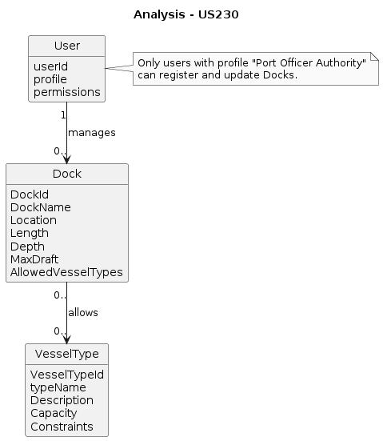
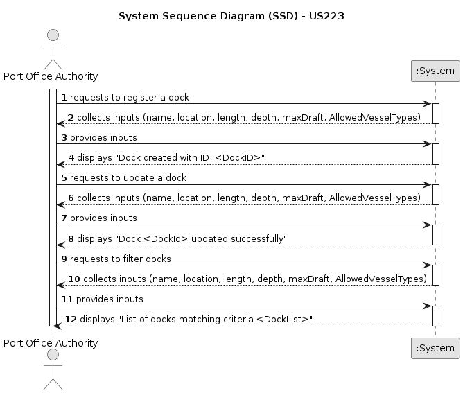
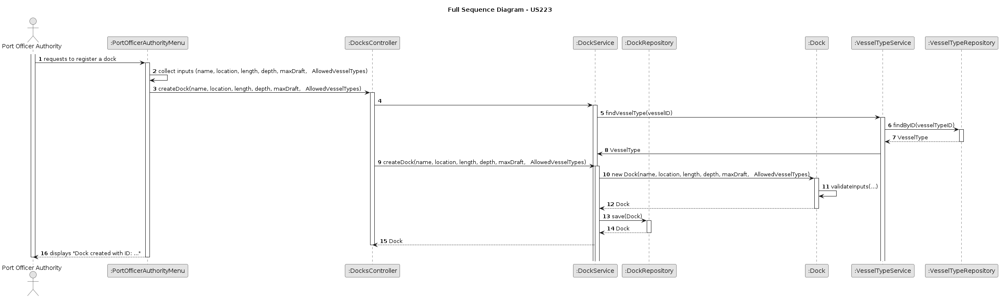
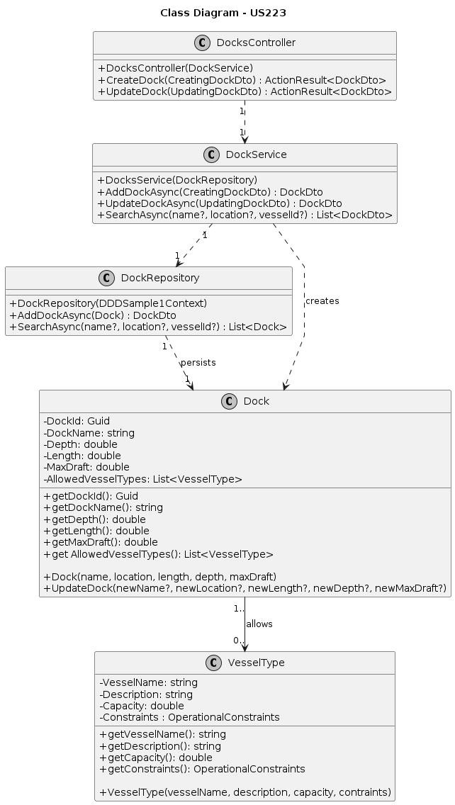

# US223 - Register and Update Docks

## 1. Context
This user story, assigned in Sprint 1, enables Port Authority Officers to register and update docks within the Port Management System. It supports the core operational process of maintaining accurate information on docking facilities, including each dock’s physical characteristics, location, and vessel type compatibility. By allowing officers to create, modify, and validate dock data, the system ensures that the port’s docking capacity is always up to date and aligned with current maritime operations. This functionality is critical for effective berth allocation, resource planning, and overall port efficiency, directly contributing to the authority’s goal of maintaining safe and optimized port operations.

### 1.1 List of Issues

- **Analysis**: Define data requirements and validation rules for dock operations.
- **Design**: Plan the data model and system components for dock management.
- **Implementation**: Develop APIs, services for dock registration and update.
- **Testing**: Validate docks registration and update functionalities.

## 2. Requirements

US223: As a Port Authority Officer, I want to register and update docks, so that thesystem accurately reflects the docking capacity of the port.

### 2.1 Acceptance Criteria

- **AC1**: A dock record must include a unique identifier, name/number, location within the port, and physical characteristics (e.g., length, depth, max draft).

- **AC2**: The officer must specify the vessel types allowed to berth there.

- **AC#**: Docks must be searchable and filterable by name, vessel type, and location.

## 3. Analysis

## 4. Design

### 4.1 Data Structures

- **Dock**: An entity with embedded value objects:
    * **dockID**: Unique identifier
    * **dockName**: Descriptive name or number of the dock.
    * **location**: Represents the dock location within the port
    * **depth**: Water depth at the dock (in meters).
    * **length**: Total length of the dock (in meters).
    * **maxDraft**: Maximum vessel draft supported (in meters).
    * **allowedVesselTypes**: Collection of VesselType entities permitted to berth at this dock.

The **VesselType** entity is managed separately (see US221), but docks must reference existing vessel types to enforce berth compatibility.

### 4.2 System Flow

1. Officer accesses the Dock Management section.
2. Officer selects to create a new dock or update an existing dock.
3. System requests input for dock details including name, location, physical characteristics, and allowed vessel types.
4. Officer submits the form with valid data.
5. System validates data and persists the dock record.
6. System confirms success or reports errors.
7. Officer can search docks by name, location, or vessel type for review or updates.

### 4.3 Acceptance Tests

- **Test 1**: Verify that a dock with valid inputs is successfully registered or updated.
    * Refers to: AC1, AC2
    * Method: Input valid dock data including name, location, physical characteristics and allowed vessel types via the API, then verify the dock record is persisted with correct details.

- **Test 2**: Ensure registration or update fails if specified vessel types do not exist or are invalid.
    * Refers to: AC2
    * Method: Attempt to register or update a dock with vessel type IDs that are missing or invalid and verify the system returns an error indicating invalid vessel types.

- **Test 3**: Confirm validation rejects invalid dock inputs (e.g., empty name, negative length).
    * Refers to: AC1
    * Method: Submit dock data with invalid or missing fields and verify the UI or API responds with appropriate validation error messages.

## 5. Implementation

- **Tools**:
    * **Language**: C#
    * **Framework**: .NET 6 (ASP.NET Core)
    * **Database**: SQL Server (?)

- **Key Components**:
  * Entities: Dock and VesselType
  * Repository: Data access abstraction for docks and vessel types
  * Service: Business logic for creating and updating dock
  * Controllers: REST endpoints for dock management
  * Tests: Unit and integration tests for service and API layers

## 6. Demonstration

### 6.1 Dock Registration

Run the Port Management application, log in as a Port Authority Officer, select option [] from the Port Authority Officer Menu, and enter valid data for each required field to register a Dock.

### 6.1 Dock Update

Run the Port Management application, log in as a Port Authority Officer, select option [] from the Port Authority Officer Menu, and enter valid data for each required field to update a Dock.

## 7. Observations

### 7.1 Critical Perspective

The initial implementation assumes a single API endpoint for dock registration (POST /api/docks). However, future iterations may need to account for enhancements and considerations, including *bulk Dock Registration*: In case of large-scale operations, a bulk registration feature may be necessary to allow the system to handle multiple dock registrations in a single request. This would help streamline processes like port expansion or updating a large number of docks simultaneously.