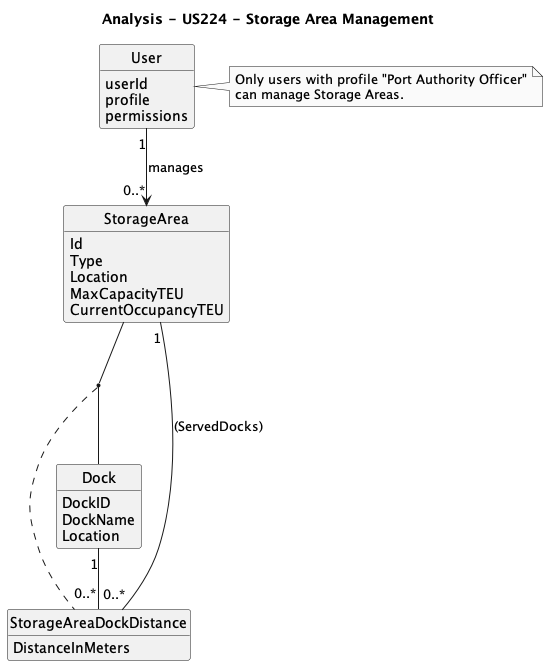
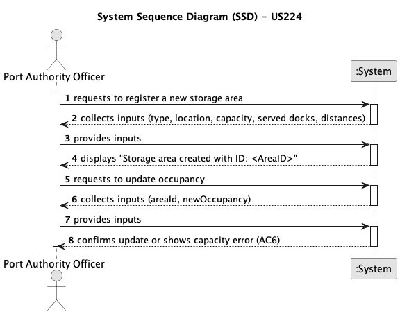
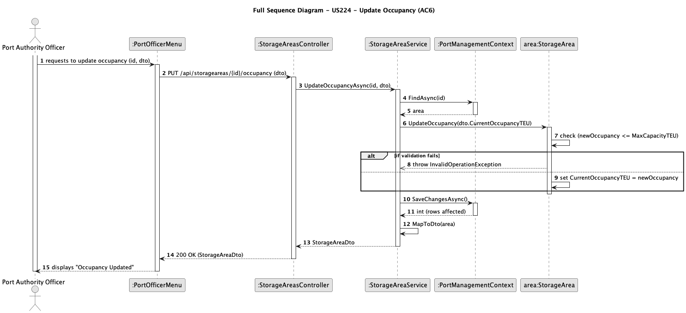
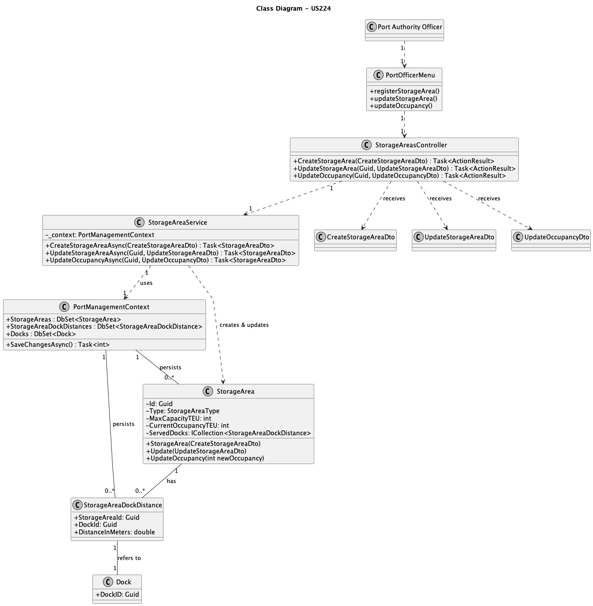

# US224 - Register and Managing Storage Areas

## 1. Context

This user story, assigned in Sprint 1, allows a Port Authority Officer to register and manage the port's storage facilities, such as container yards and warehouses. This is a foundational function for logistics, as it defines the capacity and constraints of where cargo can be stored.

This functionality supports all subsequent (un)loading operations by ensuring that cargo is assigned to a valid storage location with sufficient capacity. It also captures critical constraints, such as which specific docks a storage area serves and the distances involved, which is vital for future optimization algorithms.

### 1.1 List of Issues

* **Analysis**: Define the attributes of a storage area (type, capacity, occupancy) and the mechanism for handling constraints (which docks it serves) and distances.
* **Design**: Plan the data model, including a primary `StorageArea` entity and a relational entity `StorageAreaDockDistance` to manage the many-to-many relationship with Docks and store distance data. Design DTOs for creation and for specialized updates (e.g., occupancy).
* **Implementation**: Develop the API endpoints, services, and model logic to create areas, update their properties, and, most critically, validate occupancy changes against capacity (AC6).
* **Testing**: Validate the creation of new areas, the logic for assigning docks, and especially the business rule that prevents occupancy from exceeding capacity.

## 2. Requirements

**US224**: As a Port Authority Officer, I want to register and update storage areas, so that (un)loading and storage operations can be assigned to the correct locations.

### 2.1 Acceptance Criteria

* **AC1**: Each storage area must have a unique identifier, type (e.g., yard, warehouse), and location within the port.
* **AC2**: Storage areas must specify maximum capacity (in TEUs) and current occupancy.
* **AC3**: By default, a storage area serves the entire port (i.e., all docks).
* **AC4**: However, some storage areas (namely yards) may be constrained to serve only a few docks, usually the closest ones.
* **AC5**: Complementary information, such as the distance between docks and storage areas, must be manually recorded to support future logistics planning and optimization.
* **AC6**: Updates to storage areas must not allow the current occupancy to exceed maximum capacity.

## 3. Analysis

This domain diagram shows the main entities. A `User` (Port Authority Officer) manages `StorageArea` entities. A `StorageArea` can be associated with multiple `Docks`, and this relationship (modeled as `StorageAreaDockDistance`) stores the distance between them.



## 4. Design







## 4.1 Data Structures

* **StorageArea**: The primary entity holding location, type, and capacity data. It contains the business logic to validate capacity constraints.
* **StorageAreaDockDistance**: A relational entity that connects a StorageArea to a Dock. This single entity satisfies both AC4 (the existence of a record constrains the area to that dock) and AC5 (the `DistanceInMeters` property stores the distance). If an area has no records in this table, it serves all docks (AC3).
* **DTOs**:
    * **CreateStorageAreaDto**: Collects all initial data, including the list of docks to serve.
    * **UpdateStorageAreaDto**: For general-purpose updates (e.g., changing location).
    * **UpdateOccupancyDto**: A specialized, single-purpose DTO to handle the critical AC6 operation.

## 4.2 System Flow

1.  The Port Authority Officer (PAO) submits a `CreateStorageAreaDto` to the `POST /api/storageareas` endpoint.
2.  The Controller calls the Service (`CreateStorageAreaAsync`).
3.  The Service creates the `StorageArea` entity and saves it to get an ID.
4.  The Service validates all `DockIds` from the DTO's `ServedDocks` list.
5.  If valid, the Service creates and saves the `StorageAreaDockDistance` entities, linking the area to the docks (AC4, AC5).
6.  A `StorageAreaDto` is returned.
7.  For Occupancy (AC6): The PAO submits an `UpdateOccupancyDto` to `PUT /api/storageareas/{id}/occupancy`.
8.  The Controller calls the Service (`UpdateOccupancyAsync`).
9.  The Service retrieves the `StorageArea` entity.
10. The Service calls the model's `area.UpdateOccupancy(newOccupancy)` method.
11. The model itself checks if `newOccupancy > MaxCapacityTEU`. If true, it throws an `InvalidOperationException`.
12. If the check passes, the model updates its state, and the Service saves the change.

## 4.3 Acceptance Tests

* **Test 1 (Create Area)**: Verify that posting a valid `CreateStorageAreaDto` creates the `StorageArea` and all associated `StorageAreaDockDistance` records.
    * **Refers to**: AC1, AC2, AC4, AC5
    * **Method**: `POST` to `/api/storageareas` with valid data. Verify 201 Created and check database tables.
* **Test 2 (Create Default Area)**: Verify that posting a `CreateStorageAreaDto` with an empty `ServedDocks` list succeeds (AC3).
    * **Refers to**: AC1, AC2, AC3
    * **Method**: `POST` to `/api/storageareas` with `ServedDocks: []`. Verify 201 Created.
* **Test 3 (Update Occupancy - Success)**: Verify that updating occupancy to a value less than or equal to `MaxCapacityTEU` succeeds.
    * **Refers to**: AC6
    * **Method**: `PUT` to `.../{id}/occupancy` with `{"currentOccupancyTEU": 50}` (when capacity is 100). Verify 200 OK.
* **Test 4 (Update Occupancy - Fail)**: Verify that updating occupancy to a value greater than `MaxCapacityTEU` fails.
    * **Refers to**: AC6
    * **Method**: `PUT` to `.../{id}/occupancy` with `{"currentOccupancyTEU": 101}` (when capacity is 100). Verify HTTP 409 Conflict and an error message.
* **Test 5 (Update Capacity - Fail)**: Verify that updating `MaxCapacityTEU` to a value less than `CurrentOccupancyTEU` fails.
    * **Refers to**: (Implied by AC6)
    * **Method**: `PUT` to `.../{id}` with `{"maxCapacityTEU": 40}` (when occupancy is 50). Verify HTTP 409 Conflict.

## 5. Implementation

**Tools**:

* **Language**: C#
* **Framework**: .NET (ASP.NET Core)
* **Database**: SQL Server (via Entity Framework Core)

**Key Components**:

* **Entities**: `StorageArea`, `StorageAreaDockDistance`, `Dock` (existing).
* **DTOs**: `CreateStorageAreaDto`, `UpdateStorageAreaDto`, `UpdateOccupancyDto`, `StorageAreaDto`, `DockDistanceDto`.
* **Service**: `StorageAreaService`.
* **Controller**: `StorageAreasController`.

## 6. Demonstration

### 6.1 Register Storage Area

1.  Ensure at least one `Dock` exists in the database. Copy its `DockID`.
2.  Using an API tool, send a `POST` request to `.../api/storageareas`.
3.  In the body, provide JSON:
    ```json
    {
      "type": "Yard",
      "location": "Yard A - North",
      "maxCapacityTEU": 1500,
      "servedDocks": [
        {
          "dockId": "...",
          "distanceInMeters": 250
        }
      ]
    }
    ```
4.  Verify the response is 201 Created and the data is saved.

### 6.2 Test Occupancy Constraint (AC6)

1.  Using the `Id` from the area created above, send a `PUT` request to `.../api/storageareas/{id}/occupancy`.
2.  In the body, provide JSON that exceeds capacity: `{"currentOccupancyTEU": 2000}`.
3.  Verify the response is an HTTP 409 Conflict with a clear error message.
4.  Send a new request with valid data: `{"currentOccupancyTEU": 500}`.
5.  Verify the response is 200 OK.

## 7. Observations

The most critical part of this user story is the business rule AC6. This logic is encapsulated within the `StorageArea.UpdateOccupancy()` method, not placed in the service. This follows Domain-Driven Design principles, ensuring the entity is always in a valid state and the rule cannot be bypassed. The `StorageAreaDockDistance` entity provides an elegant solution to satisfy both the dock constraint (AC4) and distance logging (AC5) simultaneously.