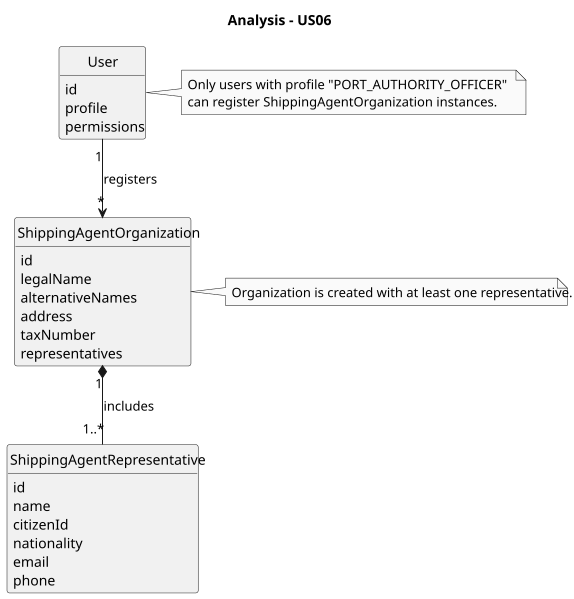
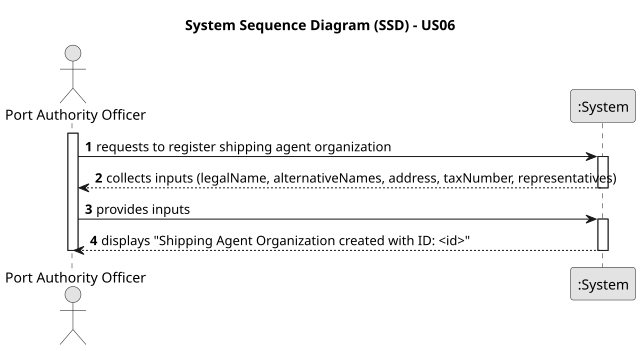
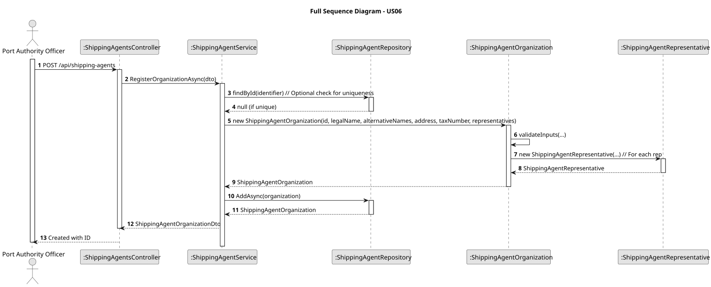
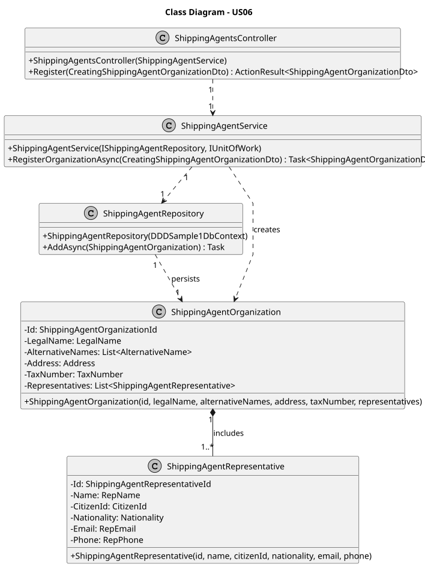

# US06 - Register Shipping Agent Organization

## 1. Context

This user story, assigned in Sprint A, allows Port Authority Officers to register new shipping agent organizations in the port logistics management system. This functionality is critical for authorizing organizations to submit vessel visit notifications and operate within the port.

### 1.1. List of Issues

- **Analysis**: Define data requirements and validation rules for shipping agent organizations and representatives.
- **Design**: Plan the data model, API, and persistence layer.
- **Implementation**: Develop the service logic, repository, and REST API endpoint.
- **Testing**: Validate organization registration and representative association checks.

## 2. Requirements

US06: As a Port Authority Officer, I want to register new shipping agent organizations, so that they can operate within the port’s digital system.

### 2.1. Acceptance Criteria

- **AC1**: The system must allow input of organization details (legal and alternative names, address, tax number) and at least one representative (name, citizen ID, nationality, email, phone) via a REST API. Identifier is automatically generated.

- **AC2**: Each organization must include at least one representative at the time of registration.

- **AC3**: Mandatory fields (legal name, address, tax number, representative details) must be validated, and email/phone must be in valid formats for notifications.

- **AC4**: The organization must be persisted in the database with a unique identifier.

### 2.2. Dependencies/References

- **NFR**: Supports data persistence using Entity Framework Core with SQL Server or in-memory databases.
- **NFR**: Requires role-based authorization to ensure only Port Authority Officers can register organizations.

## 3. Analysis

The shipping agent organization registration process is essential for the port logistics system. Port Authority Officers need a secure API to input organization and representative details. The system must enforce business rules such as ensuring at least one representative and validating all fields to maintain data integrity.

## 4. Design

### 4.1. Data Structures

- **ShippingAgentOrganization**: An aggregate root entity with value objects:
  * **Id**: Unique identifier (ShippingAgentOrganizationId).
  * **LegalName**: Legal name of the organization.
  * **AlternativeNames**: List of alternative names.
  * **Address**: Organization address.
  * **TaxNumber**: Tax identification number.
  * **Representatives**: List of associated ShippingAgentRepresentative entities.

- **ShippingAgentRepresentative**: An entity within the aggregate:
  * **Id**: Unique identifier (ShippingAgentRepresentativeId).
  * **Name**: Representative's name.
  * **CitizenId**: Citizen identification number.
  * **Nationality**: Representative's nationality.
  * **Email**: Email for notifications.
  * **Phone**: Phone number for notifications.

- **Relationships**: One ShippingAgentOrganization has one or more ShippingAgentRepresentatives.

### 4.2. System Flow

1. A Port Authority Officer sends a POST request to the API with organization and representative details.
2. The API validates the input:
- Ensures at least one representative.
- Validates mandatory fields and formats (e.g., email contains '@').
- The service layer constructs a ShippingAgentOrganization aggregate, enforces business rules, and persists it via the repository.
- The API returns a 201 Created response with the organization ID.

### 4.3. Acceptance Tests

- **Test 1**: Verify that an organization with valid inputs and at least one representative is persisted.
  * Refers to: AC1, AC4
  * Method: Send valid JSON data via API and check database for the new record.

- **Test 2**: Ensure registration fails if no representatives are provided.
  * Refers to: AC2
  * Method: Attempt registration without representatives and verify 400 Bad Request.

- **Test 3**: Confirm validation rejects invalid inputs (e.g., missing legal name or invalid email).
  * Refers to: AC3
  * Method: Submit invalid data and verify error responses.

## 5. Implementation

- **Language**: C#, using Entity Framework Core for persistence and ASP.NET Core for the REST API.

- **Key Components**:
  * Entities: ShippingAgentOrganization and ShippingAgentRepresentative with value objects for immutable properties.
  * Repository: Entity Framework Core repository for persisting and querying ShippingAgentOrganization aggregates.
  * Service: Business logic to validate inputs, enforce rules (e.g., at least one representative), and create organizations.
  * Controller: ASP.NET Core controller to handle POST requests and integrate with the service.
  * Tests: Unit tests (xUnit) to validate service logic and persistence.

## 6. Demonstration

Run the port logistics API, authenticate as a Port Authority Officer, and send a POST request to `/api/shipping-agents` with valid JSON payload. Verify the response includes the new organization ID and check the database for persistence.

## 7. Observations

### 7.1. Critical Perspective

The implementation assumes a single API endpoint for registration, but future iterations may need to support bulk registrations or integration with external authentication systems for representatives.