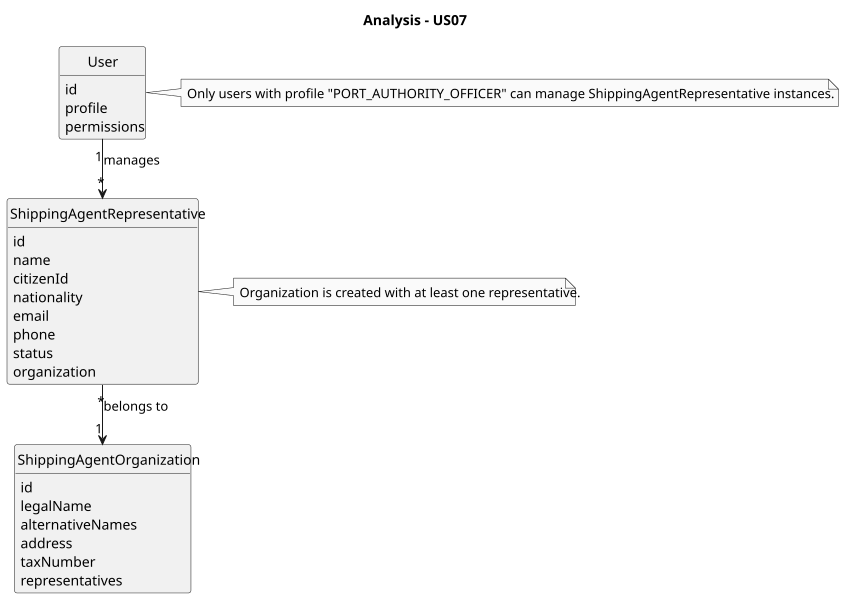
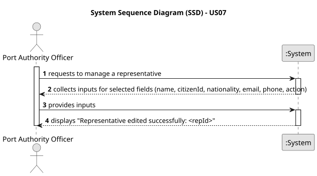
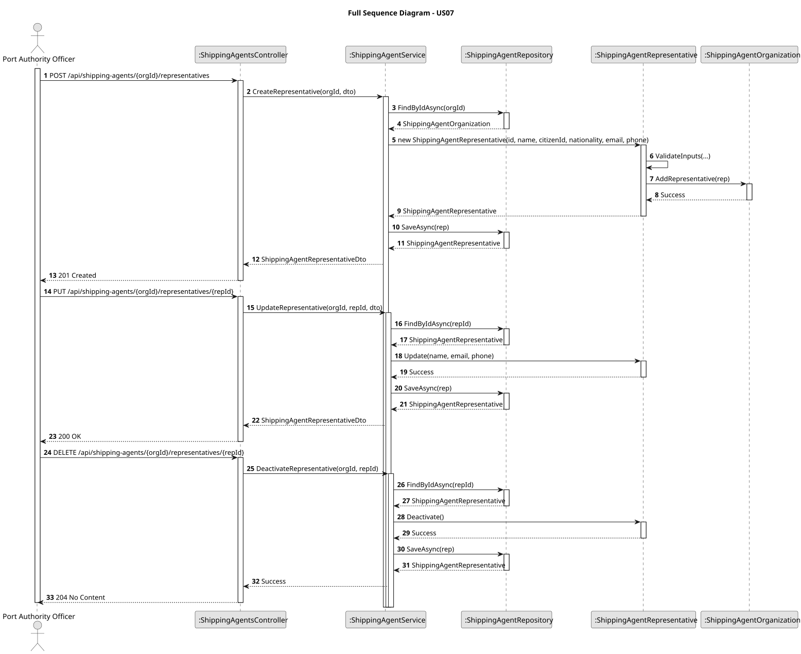
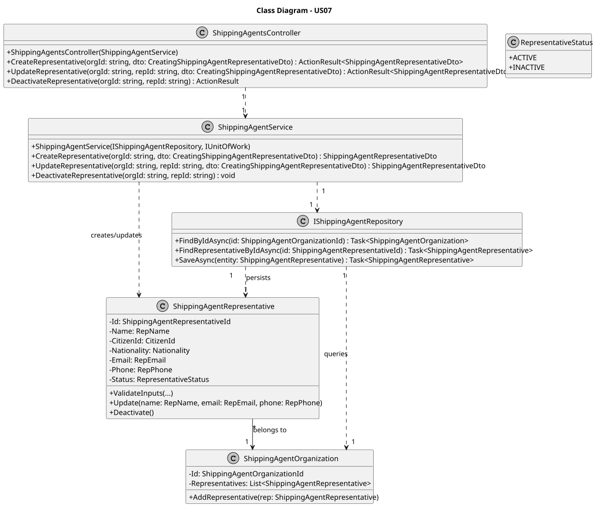

# US07 - Register/Manage Shipping Agent Representatives

## 1. Context

This user story, assigned in Sprint A, enables Port Authority Officers to register and manage representatives of shipping agent organizations in the port logistics system. It supports the core process of authorizing individuals to interact with the system on behalf of their organization, ensuring accurate data entry and integration with the shipping agent database. This functionality is critical for managing access and notifications in the port's digital system.

### 1.1. List of Issues

- **Analysis**: Define data requirements and validation rules for shipping agent representatives.
- **Design**: Plan the data model, API endpoints, and persistence layer.
- **Implementation**: Develop the REST API, service logic, and Entity Framework Core-based persistence.
- **Testing**: Validate representative creation, updates, deactivation, and association checks.

## 2. Requirements

US07: As a Port Authority Officer, I want to register and manage representatives of a shipping agent organization (create, update, deactivate), so that the right individuals are authorized to interact with the system on behalf of their organization.

### 2.1. Acceptance Criteria

- **AC1**: The system must allow creation of a representative with details (name, citizen ID, nationality, email, phone) via a REST API, associated with exactly one shipping agent organization.
- **AC2**: The system must support updating representative details (e.g., email, phone) and deactivating representatives (marking them as inactive without deletion).
- **AC3**: Mandatory fields (name, citizen ID, nationality, email, phone) must be validated, and citizen ID must be unique within the system.
- **AC4**: Each representative must be persisted in the database (e.g., SQL Server) and linked to a valid shipping agent organization.
- **AC5**: Only Port Authority Officers can perform these operations, enforced via authentication.

### 2.2. Dependencies/References

- **US06**: Relies on shipping agent organization registration to ensure organizations exist.
- **NFR01**: Supports data persistence using Entity Framework Core with SQL Server.
- **NFR02**: Requires authentication to restrict access to Port Authority Officers.

## 3. Analysis

The management of shipping agent representatives is a key feature for the port logistics system’s back-office operations. Port Authority Officers need a secure API to create, update, and deactivate representatives, ensuring only authorized individuals interact with the system. The system must enforce business rules such as unique citizen IDs and valid organization associations to maintain data integrity.

## 4. Design

### 4.1. Data Structures

- **ShippingAgentRepresentative**: An entity within the Shipping Agent Management Bounded Context:
  - **Id**: Unique identifier (string).
  - **Name**: Representative’s full name (value object).
  - **CitizenId**: Unique citizen ID (value object).
  - **Nationality**: Representative’s nationality (value object).
  - **Email**: Contact email for notifications (value object).
  - **Phone**: Contact phone number (value object).
  - **Status**: Enum (ACTIVE, INACTIVE), initialized as ACTIVE.
  - **ShippingAgentOrganization**: Associated organization (linked entity).

- **ShippingAgentOrganization**: Linked aggregate root with an identifier and list of representatives.

- **Relationships**: One ShippingAgentOrganization has one or more ShippingAgentRepresentatives; each representative is linked to exactly one organization.

### 4.2. System Flow

1. A Port Authority Officer accesses the REST API (e.g., via Swagger or a client).
2. The API prompts for representative details and validates:
  - Citizen ID: Must be unique and non-empty.
  - Mandatory fields: Name, nationality, email, phone cannot be empty.
  - Organization: Must exist and be valid.
3. The service layer constructs or updates a ShippingAgentRepresentative entity, setting status to ACTIVE (create) or INACTIVE (deactivate).
4. The repository layer persists the entity using Entity Framework Core, supporting SQL Server.
5. The API confirms successful operation with the representative’s ID or updated details.

### 4.3. Acceptance Tests

- **Test 1**: Verify that a representative with valid inputs is persisted with status ACTIVE and linked to an organization.
  - Refers to: AC1, AC4
  - Method: Send POST request with valid data and check database for the new record.
- **Test 2**: Ensure creation fails if citizen ID is not unique or organization is invalid.
  - Refers to: AC3, AC4
  - Method: Attempt creation with duplicate citizen ID and verify error response.
- **Test 3**: Confirm update and deactivation work without breaking organization association.
  - Refers to: AC2
  - Method: Send PUT/DELETE requests and verify database updates.

## 5. Implementation

- **Language**: C# using ASP.NET Core for the API and Entity Framework Core for persistence.
- **Key Components**:
  - **Entities**: ShippingAgentRepresentative and ShippingAgentOrganization with EF Core mappings.
  - **Repository**: EF Core repository for persisting and querying representatives.
  - **Service**: Business logic to validate inputs, check organization, and manage representatives.
  - **API**: REST endpoints (POST/PUT/DELETE) for create, update, deactivate operations.
  - **Tests**: Unit tests (xUnit) to validate service logic and integration tests for API.

## 6. Demonstration

Run the port logistics application, authenticate as a Port Authority Officer, and use the Swagger UI (`/swagger`) to:
- Create: POST `/api/shipping-agents/{orgId}/representatives` with valid data.
- Update: PUT `/api/shipping-agents/{orgId}/representatives/{repId}` with new details.
- Deactivate: DELETE `/api/shipping-agents/{orgId}/representatives/{repId}` to mark as inactive.

## 7. Observations

### 7.1. Critical Perspective

The implementation assumes a single Port Authority Officer manages representatives. Authentication integration (NFR02) is critical for production use.