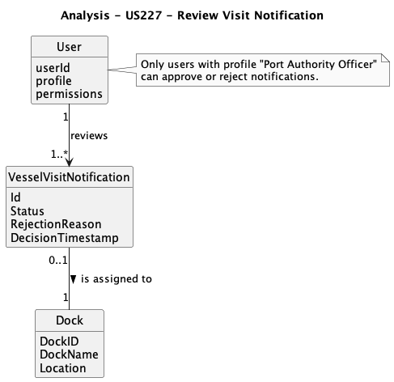
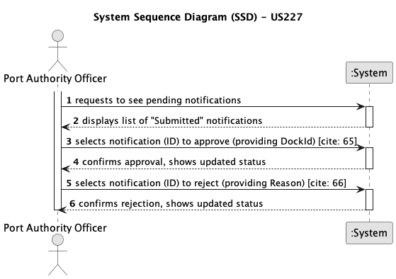
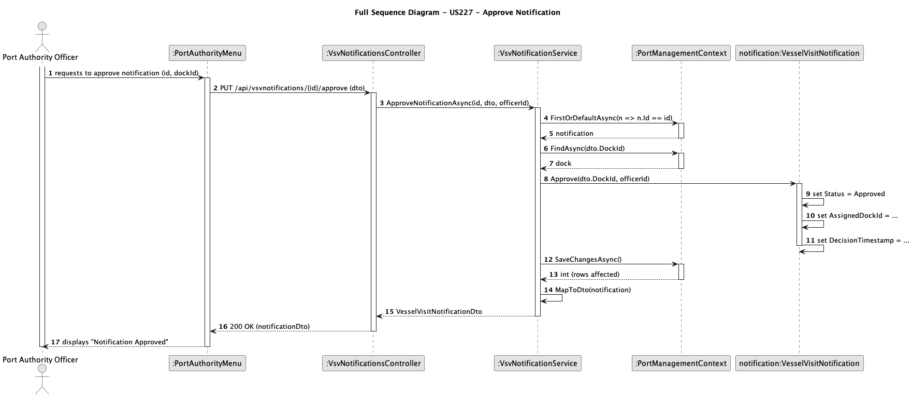
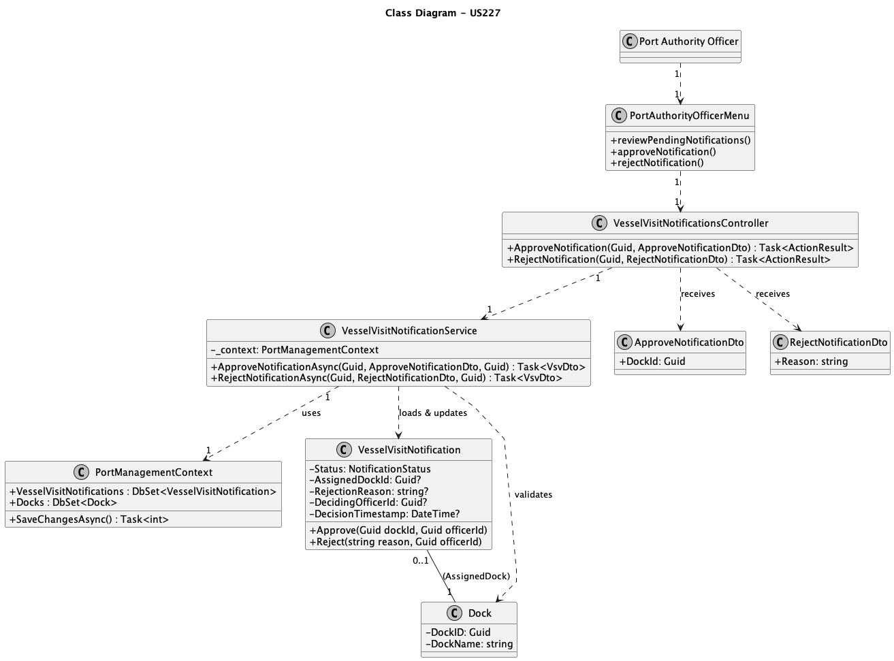

# US227 - Review Vessel Visit Notifications

## 1. Context
This user story, assigned in Sprint 1, enables Port Authority Officers to review and process pending Vessel Visit Notifications. This is a critical control point in port operations, allowing officers to either approve a visit by assigning a dock or reject it by providing a clear reason.

This functionality directly supports the core business process of managing and controlling dock schedules. By validating visit requests and managing dock allocation, the Port Authority Officer ensures that port operations remain orderly, efficient, and compliant with scheduling constraints.

### 1.1 List of Issues

-   **Analysis**: Define the decision-making process, the data required for approval (Dock ID) and rejection (Reason), and the state transitions of a `VesselVisitNotification`.
-   **Design**: Plan the data model to include decision data (assigned dock, rejection reason, audit logs) and the system components (DTOs, services, endpoints) to handle these state changes.
-   **Implementation**: Develop the API endpoints (`.../approve`, `.../reject`), service logic, and model updates to process the decisions.
-   **Testing**: Validate that approval correctly assigns a dock, rejection correctly records a reason, state transitions are enforced (i.e., only "Submitted" notifications can be actioned), and all decisions are logged.

## 2. Requirements

**US227**: As a Port Authority Officer, I want to review pending Vessel Visit Notifications and approve or reject them, so that docking schedules remain under port control.

### 2.1 Acceptance Criteria

-   **AC1**: When a notification is approved, the officer must assign a (temporarily) dock on which the vessel should berth.
-   **AC2**: When a notification is rejected, the officer must provide a reason for rejection (e.g., information is missing).
-   **AC3**: If rejected, the shipping agent representative might review / update the notification for further new decision.
-   **AC4**: All decisions (approve/reject) must be logged with timestamp, officer ID, and decision outcome for auditing purposes.

## 3. Analysis

This domain diagram shows the key entities and their relationships. The **Port Authority Officer** (represented as `User`) reviews the `VesselVisitNotification` and, upon approval, links it to a `Dock`.

## 4. Design

### 4.1 System Sequence Diagram (SSD)

This diagram shows the high-level interactions between the actor (Port Authority Officer) and the system, which is treated as a black box.

### 4.2 Full Sequence Diagram

This diagram details the complete call flow for the "Approve Notification" use case, showing how the controller, service, model, and database interact.

### 4.3 Class Diagram

This diagram displays the C# classes (DTOs, Model, Service, Controller) and their static dependencies that implement this functionality.

### 4.4 Data Structures

-   **VesselVisitNotification**: The central entity. It is updated with:
    * `Status`: Changes from `Submitted` to `Approved` or `Rejected`.
    * `AssignedDockId`: (Nullable) `Guid` of the assigned `Dock`.
    * `RejectionReason`: (Nullable) `string` containing the reason for rejection.
    * `DecidingOfficerId`: (Nullable) `Guid` for auditing.
    * `DecisionTimestamp`: (Nullable) `DateTime` for auditing.
-   **ApproveNotificationDto**: Input DTO for approval.
    * `DockId`: `Guid` (Required).
-   **RejectNotificationDto**: Input DTO for rejection.
    * `Reason`: `string` (Required, with min/max length).

### 4.5 System Flow

1.  The Port Authority Officer (PAO) requests a list of pending notifications (those with status "Submitted").
2.  The PAO selects a notification and chooses an action: "Approve" or "Reject".
3.  **If "Approve"**:
    1.  The PAO submits the request with the `DockId` (via `ApproveNotificationDto`).
    2.  The `Controller` receives the call on the `.../{id}/approve` endpoint.
    3.  The `Service` is called (`ApproveNotificationAsync`).
    4.  The `Service` finds the notification and validates that the `Dock` exists.
    5.  The `Service` calls the `.Approve(dockId, officerId)` method on the `VesselVisitNotification` model.
    6.  The Model updates its internal state to `Approved`, stores the `DockId`, and records audit data.
    7.  The `Service` saves the changes to the database.
4.  **If "Reject"**:
    1.  The PAO submits the request with the `Reason` (via `RejectNotificationDto`).
    2.  The `Controller` receives the call on the `.../{id}/reject` endpoint.
    3.  The `Service` is called (`RejectNotificationAsync`).
    4.  The `Service` finds the notification.
    5.  The `Service` calls the `.Reject(reason, officerId)` method on the `VesselVisitNotification` model.
    6.  The Model updates its internal state to `Rejected`, stores the `RejectionReason`, and records audit data.
    7.  The `Service` saves the changes to the database.
5.  The system returns the updated notification to the PAO.

### 4.6 Acceptance Tests

-   **Test 1 (Approve)**: Verify that approving a "Submitted" notification with a valid `DockId` changes its status to "Approved" and correctly stores the `AssignedDockId`.
    * Refers to: AC1, AC4
    * Method: Send a `PUT` request to `.../{id}/approve` with a valid `ApproveNotificationDto`. Verify the 200 OK response and check the database fields.

-   **Test 2 (Reject)**: Verify that rejecting a "Submitted" notification with a valid `Reason` changes its status to "Rejected" and stores the `RejectionReason`.
    * Refers to: AC2, AC4
    * Method: Send a `PUT` request to `.../{id}/reject` with a valid `RejectNotificationDto`. Verify the 200 OK response and check the `RejectionReason` field.

-   **Test 3 (Invalid State)**: Verify that an attempt to approve or reject a notification that is *not* in "Submitted" status (e.g., "Approved" or "InProgress") fails.
    * Refers to: US227 (State Logic)
    * Method: Send an approve/reject request for a notification with status "Approved". Verify the system returns an HTTP `409 Conflict` error.

-   **Test 4 (Invalid Data)**: Verify that an approval request without a `DockId` or a rejection request without a `Reason` is rejected.
    * Refers to: AC1, AC2
    * Method: Send incomplete DTOs. Verify the system returns an HTTP `400 Bad Request` due to DTO validation.

## 5. Implementation

-   **Tools**:
    * **Language**: C#
    * **Framework**: .NET (ASP.NET Core)
    * **Database**: SQL Server (via Entity Framework Core)

-   **Key Components**:
    * **Entities**: `VesselVisitNotification` (updated), `Dock`.
    * **DTOs**: `ApproveNotificationDto`, `RejectNotificationDto`.
    * **Service**: `VesselVisitNotificationService` (methods `ApproveNotificationAsync`, `RejectNotificationAsync`).
    * **Controller**: `VesselVisitNotificationsController` (endpoints `PUT .../{id}/approve`, `PUT .../{id}/reject`).
    * **Tests**: Unit tests for the state logic in the model (`Approve`/`Reject`) and for the service.

## 6. Demonstration

### 6.1 Approve Notification

1.  Ensure a `VesselVisitNotification` exists in the database with `Status = "Submitted"`.
2.  Ensure a `Dock` exists and copy its `DockID`.
3.  Using an API tool (like Postman or Swagger), send a `PUT` request to `.../api/vesselvisitnotifications/{id}/approve`.
4.  In the request *body*, provide the JSON: `{ "dockId": "..." }`.
5.  Verify the response is `200 OK` and the notification's `Status` is now `Approved` and the `assignedDockId` matches.

### 6.2 Reject Notification

1.  Ensure a `VesselVisitNotification` exists with `Status = "Submitted"`.
2.  Send a `PUT` request to `.../api/vesselvisitnotifications/{id}/reject`.
3.  In the *body*, provide the JSON: `{ "reason": "Missing critical cargo manifest data." }`.
4.  Verify the response is `200 OK` and the `Status` is `Rejected` and the `rejectionReason` is saved.

## 7. Observations

This user story is central to port control. The implementation focuses on **Safe State Transitions**, ensuring that the business logic (`Approve`/`Reject`) is encapsulated within the `VesselVisitNotification` model itself. This prevents the service from ever putting the object into an invalid state (e.g., approving an already-rejected notification). The use of action-specific DTOs (`ApproveNotificationDto`, `RejectNotificationDto`) makes the API's intent explicit and secure.