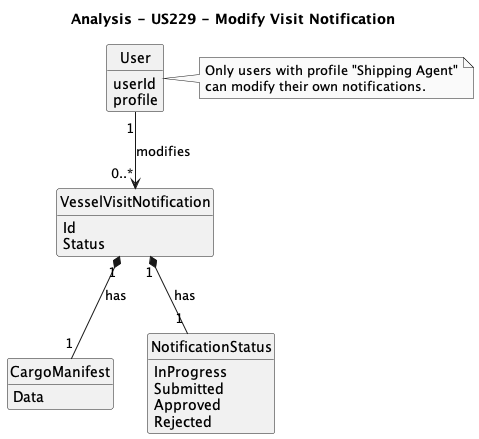
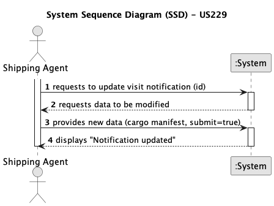
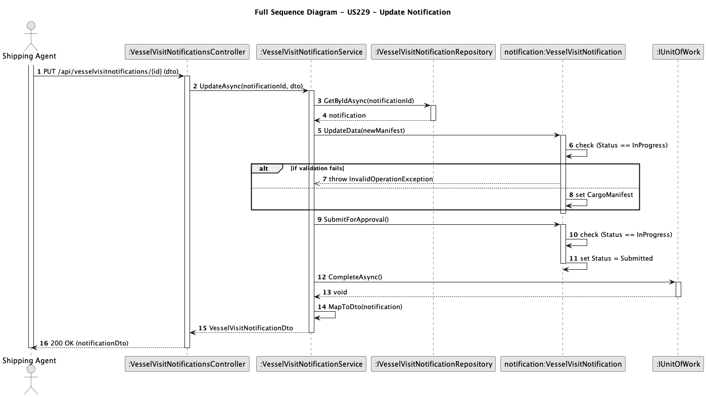
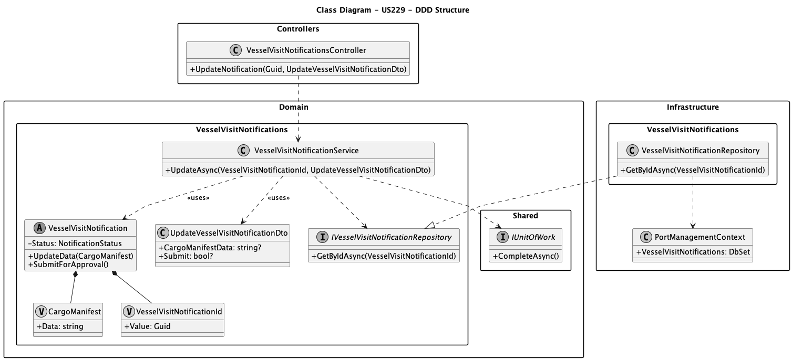

# US229 - Modify Vessel Visit Notification

## 1. Context
This user story, assigned in Sprint 1, allows a Shipping Agent to modify and finalize an existing Vessel Visit Notification. This is a critical feature for data entry, allowing agents to save a draft ("In Progress") and later update it with more information (like a final cargo manifest) before submitting it for official review.

This functionality directly supports the business process of data preparation and submission. The core logic dictates that these modifications are only allowed while the notification is in an "In Progress" state. This user story also covers the agent's action of "submitting" the notification, which locks it from further agent edits and moves it into the queue for the Port Authority Officer (US227).

### 1.1 List of Issues 

-   **Analysis**: Define the state-based business rules for modification. A notification can only be edited or submitted if its current status is `InProgress`.
-   **Design**: Plan the system components following DDD principles, ensuring the `VesselVisitNotification` entity encapsulates its own state logic (`UpdateData`, `SubmitForApproval`). Design Value Objects for its properties and a Domain Service to orchestrate the use case.
-   **Implementation**: Develop the API endpoint (`PUT /api/vesselvisitnotifications/{id}`), the Domain Service, and the Repository implementation required to persist the changes.
-   **Testing**: Validate that a notification in `InProgress` state can be successfully updated and/or submitted. Crucially, validate that any attempt to modify a notification in a `Submitted` or `Approved` state is rejected by the system.

## 2. Requirements

**US229**: As a Shipping Agent, I want to modify a Vessel Visit Notification that is in "In Progress" state, so that I can update its information or submit it for approval.

### 2.1 Acceptance Criteria

-   **AC1**: A user must be able to retrieve a notification by its ID.
-   **AC2**: The user can modify the notification's data (e.g., Cargo Manifest) only if its current status is `InProgress`.
-   **AC3**: The user can change the notification's status from `InProgress` to `Submitted`.
-   **AC4**: If an attempt is made to modify a notification that is not `InProgress` (e.g., `Submitted`, `Approved`), the system must return an error.
-   **AC5**: Once a notification is set to `Submitted`, it can no longer be modified by the agent.

## 3. Analysis

The domain model shows that the `Shipping Agent` (represented as `User`) interacts with the `VesselVisitNotification` Aggregate. The notification's behavior is dictated by its `NotificationStatus`. The `CargoManifest` is modeled as a Value Object, representing a piece of descriptive data within the notification aggregate.



## 4. Design

### 4.1 System Sequence Diagram (SSD)

This SSD shows the actor (`Shipping Agent`) interacting with the system as a black box. The agent provides the ID of the notification to update, along with the new data. The system responds with either a confirmation or an error (e.g., if the notification is in a non-modifiable state).



### 4.2 Full Sequence Diagram

This diagram shows the detailed collaboration between the DDD layers for the update operation. The `Controller` calls the `VesselVisitNotificationService`, which uses the `IVesselVisitNotificationRepository` to get the entity. Crucially, the `Service` then calls methods like `UpdateData()` on the `VesselVisitNotification` **entity itself**, which is where the business rule (AC4) is enforced. Finally, the `IUnitOfWork` commits the change.



### 4.3 Class Diagram

This diagram shows the DDD structure. The `Controller` depends on the `VesselVisitNotificationService` (in `Domain`). The `Service` depends on the `IVesselVisitNotificationRepository` interface (also in `Domain`). The `VesselVisitNotificationRepository` (in `Infrastructure`) implements this interface and uses the `PortManagementContext`.



### 4.4 Data Structures

-   **VesselVisitNotification**: The Aggregate Root entity. It contains the methods (`UpdateData`, `SubmitForApproval`) that encapsulate the state-change logic (AC2, AC3, AC4).
-   **VesselVisitNotificationId**: A Value Object representing the unique identifier, ensuring it's always a valid `Guid`.
-   **CargoManifest**: A Value Object representing the manifest data. This separates it from simple primitive types and allows for future validation.
-   **UpdateVesselVisitNotificationDto**: An input DTO used by the `Controller` to receive data from the API request. It contains nullable properties for `CargoManifestData` and a `Submit` flag.

### 4.5 System Flow

1.  A `Shipping Agent` sends a `PUT` request to `/api/vesselvisitnotifications/{id}` with an `UpdateVesselVisitNotificationDto` in the body.
2.  The `VesselVisitNotificationsController` receives the request.
3.  The `Controller` converts the `Guid` ID into a `VesselVisitNotificationId` Value Object.
4.  The `Controller` calls `UpdateAsync` on the `VesselVisitNotificationService`, passing the ID and DTO.
5.  The `Service` uses the `IVesselVisitNotificationRepository` to fetch the `VesselVisitNotification` entity from the database.
6.  If not found, it throws an `EntityNotFoundException` (which the controller returns as `404 Not Found`).
7.  If data is present in the DTO, the `Service` calls the `notification.UpdateData(newManifest)` method. The **entity itself** checks if `Status == InProgress`.
8.  If `dto.Submit == true`, the `Service` calls `notification.SubmitForApproval()`. The **entity itself** checks the status again before changing it to `Submitted`.
9.  If either entity method throws an `InvalidOperationException` (due to AC4), the `Service` lets it bubble up. The `Controller` catches it and returns a `409 Conflict`.
10. If successful, the `Service` calls `_unitOfWork.CompleteAsync()` to save the changes to the database.
11. The `Service` maps the updated entity to a `VesselVisitNotificationDto` and returns it.
12. The `Controller` returns a `200 OK` response with the DTO.

### 4.6 Acceptance Tests

-   **Test 1 (Success - Update Data)**: Verify that sending a `PUT` request with new `cargoManifestData` for a notification in `InProgress` state successfully updates the data and returns 200 OK.
    * Refers to: AC2
    * Method: Send a `PUT` to `.../{id}` with `{"cargoManifestData": "..."}` for an `InProgress` notification. Verify 200 OK and check database.

-   **Test 2 (Success - Submit)**: Verify that sending a `PUT` request with `submit: true` for a notification in `InProgress` state changes its status to `Submitted` and returns 200 OK.
    * Refers to: AC3
    * Method: Send a `PUT` to `.../{id}` with `{"submit": true}` for an `InProgress` notification. Verify 200 OK and check status in DB.

-   **Test 3 (Fail - Already Submitted)**: Verify that sending a `PUT` request (either to update data or to submit) for a notification that is already `Submitted` fails and returns an HTTP `409 Conflict`.
    * Refers to: AC4, AC5
    * Method: Send a `PUT` to `.../{id}` for a `Submitted` notification. Verify HTTP `409 Conflict` response.

-   **Test 4 (Fail - Not Found)**: Verify that sending a `PUT` request with a non-existent `Guid` returns an HTTP `404 Not Found`.
    * Refers to: AC1
    * Method: Send a `PUT` to `.../{invalid-guid}`. Verify HTTP `404 Not Found` response.

## 5. Implementation

-   **Tools**:
    * **Language**: C#
    * **Framework**: .NET (ASP.NET Core)
    * **Database**: SQL Server (via Entity Framework Core)

-   **Key Components**:
    * **Domain**: `VesselVisitNotification` (Entity), `VesselVisitNotificationId` (Value Object), `CargoManifest` (Value Object), `NotificationStatus` (Enum), `IVesselVisitNotificationRepository` (Interface), `VesselVisitNotificationService` (Domain Service), `UpdateVesselVisitNotificationDto`, `VesselVisitNotificationDto`.
    * **Infrastructure**: `VesselVisitNotificationRepository` (Repository), `VesselVisitNotificationEntityTypeConfiguration`, `PortManagementContext` (updated).
    * **Controllers**: `VesselVisitNotificationsController`.

## 6. Demonstration

### 6.1 Update and Submit Notification

1.  **Prerequisite**: Ensure a `VesselVisitNotification` exists in the database with `Id = 'some-guid'` and `Status = "InProgress"`.
2.  **Action**: Using an API tool, send a `PUT` request to `/api/vesselvisitnotifications/some-guid`.
3.  **Request Body**:
    ```json
    {
      "cargoManifestData": "Updated manifest: 500 containers of electronics.",
      "submit": true
    }
    ```
### 4. Verification

Verify the response is `200 OK`. The returned JSON should show `"status": "Submitted"`. Check the database to confirm the `CargoManifestData`and `Status`columns are updated.

### 6.2 Attempt to Modify a Submitted Notification

1.  **Prerequisite**: Use the same notification from the previous test, which now has `Status = "Submitted"`.
2.  **Action**: Send another `PUT`request to `/api/vesselvisitnotifications/some-guid`.
3.  **Request body**:
    ```json
    {
      "cargoManifestData": "Trying to update again."
    }
    ```
4.  **Expected Response**: `409 Conflict`with an error message like "Notification can only be modified while 'In progress'".

## 7. Observations

This user story is a prime example of encapsulating business rules within the domain entity.