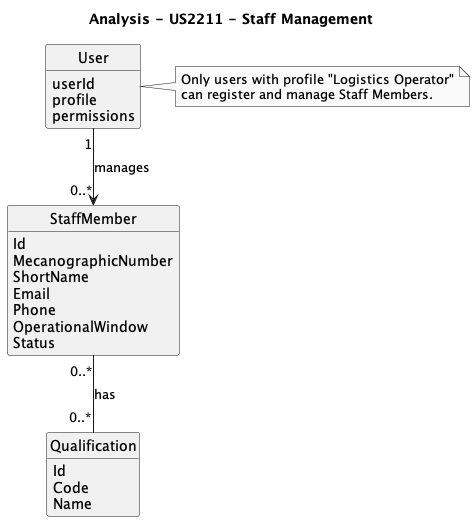
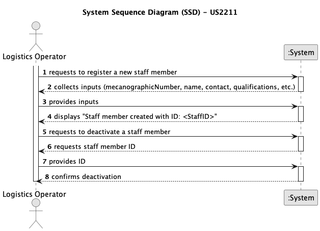
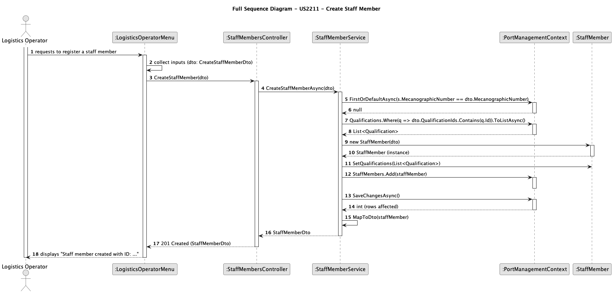
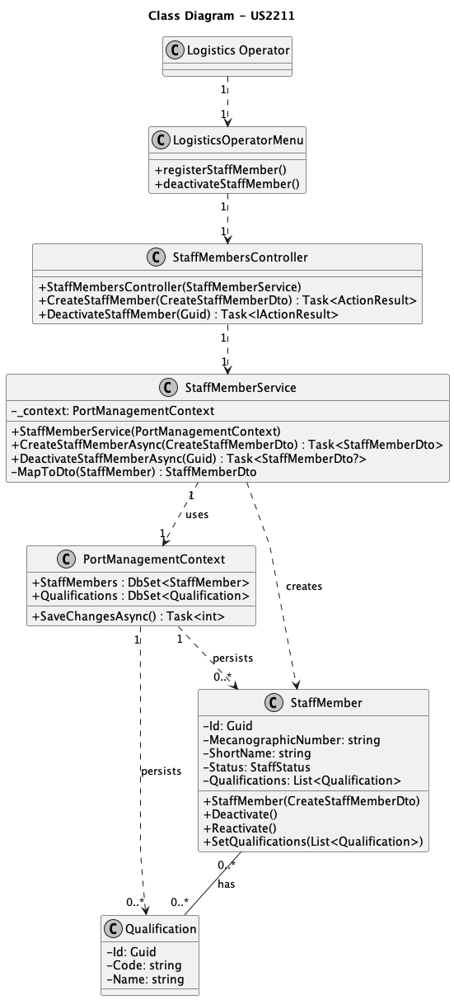

# US2211 - Register and Managing Staff Members

## 1. Context
This user story, assigned in Sprint 1, enables Logistics Operators to register, update, and manage operating staff members within the Operations Management System.
It supports the core operational process of maintaining accurate information on staff availability and qualifications, ensuring that only eligible personnel are assigned to scheduled resources.
By allowing operators to create, modify, and deactivate staff records, the system ensures that workforce data remains current and consistent with actual operational capacity. This functionality is critical for effective resource planning, personnel allocation, and operational safety, directly contributing to the organization’s goal of maintaining efficient and reliable operations.
### 1.1 List of Issues

-  **Analysis**: Define data requirements and validation rules for staff member registration and management.
- **Design**: Plan the data model and system components for managing staff lifecycle (create, update, deactivate).
- **Implementation**: Develop APIs, services, and UI components to support staff registration, editing, and deactivation.
- **Testing**: Validate the functionalities for staff creation, update, and deactivation, ensuring data integrity and traceability.

## 2. Requirements

US2211: As a Logistics Operator, I want to register and manage operating staff members (create, update, deactivate), so that the system can accurately reflect staff availability and ensure that only qualified personnel are assigned to resources during scheduling.

### 2.1 Acceptance Criteria

- **AC1**: Each staff member must have a unique ID (mecanographic number), short name, contact details (email, phone), qualifications, operational window, and current status (e.g., available, unavailable).

- **AC2**: Deactivation/reactivation must not delete staff data but preserve it for audit and historical planning purposes.

- **AC3**: Staff members must be searchable and filterable by ID, name, status, and qualifications.

- **AC4**: Validation must ensure that duplicate IDs or incomplete data (e.g., missing qualifications or contact info) are rejected.

## 3. Analysis

## 4. Design

### 4.1 Data Structures

- **StaffMember**: An entity with embedded value objects:
    * **staffID**: Unique mecanographic identifier.
    * **shortName**: Abbreviated name for internal use.
    * **contactDetails**: Email and phone number.
    * **qualifications**: List of competencies or certifications.
    * **operationalWindow**: Time period during which the staff member is active or available.
    * **status**: Current operational status (available, unavailable, deactivated).

### 4.2 System Flow

1. The Logistics Operator accesses the Staff Management section.
2. The Operator selects the option to create, update, or deactivate a staff member.
3. The system requests input for required fields: identification, contact details, qualifications, and availability.
4. The Operator submits the form with valid data.
5. The system validates all inputs and persists the staff record.
6. When deactivating, the system marks the record as inactive but retains it for historical and audit purposes.
7. The Operator can search and filter staff members by ID, name, status, or qualifications for review and planning.

[[diagram - to be added]]

### 4.3 Acceptance Tests

- **Test 1**: Verify that a staff member with valid inputs is successfully created or updated.
    * Refers to: AC1, AC4
    * Method: nput valid staff data (name, contact, qualifications, status) via API/UI and verify the record is stored correctly.
      
- **Test 2**: Ensure that deactivation preserves the staff record for audit and planning.
    * Refers to: AC2
    * Method: Deactivate a staff member and confirm their data remains accessible in historical or reporting views.

- **Test 3**: Confirm that duplicate or invalid entries are rejected.
    * Refers to: AC1, AC4
    * Method: Attempt to create a staff record with an existing ID or missing required fields and verify validation errors.

## 5. Implementation

- **Tools**:
    * **Language**: C#
    * **Framework**: .NET 6 (ASP.NET Core)
    * **Database**: SQL Server (?)

- **Key Components**:
  * Entities: StaffMember, Qualification.
  * Repository: Data access layer for staff entities.
  * Service: Business logic for staff management (create, update, deactivate).
  * Controllers: REST endpoints for staff operations (?).
  * Tests: Unit and integration tests for service and API layers.

## 6. Demonstration

### 6.1 Staff Member Registration

Run the Operations Management application, log in as a Logistics Operator, navigate to Staff Management, and enter valid data for each required field to register a new staff member.

### 6.2 Staff Member Update

Access the Staff Management section, select an existing staff member, and update the relevant information (e.g., contact details, qualifications).

### 6.3 Staff Member Deactivation

Select a staff member to deactivate, confirm the action, and verify that the record status changes to inactive while remaining stored in the system.

## 7. Observations

### 7.1 Critical Perspective
